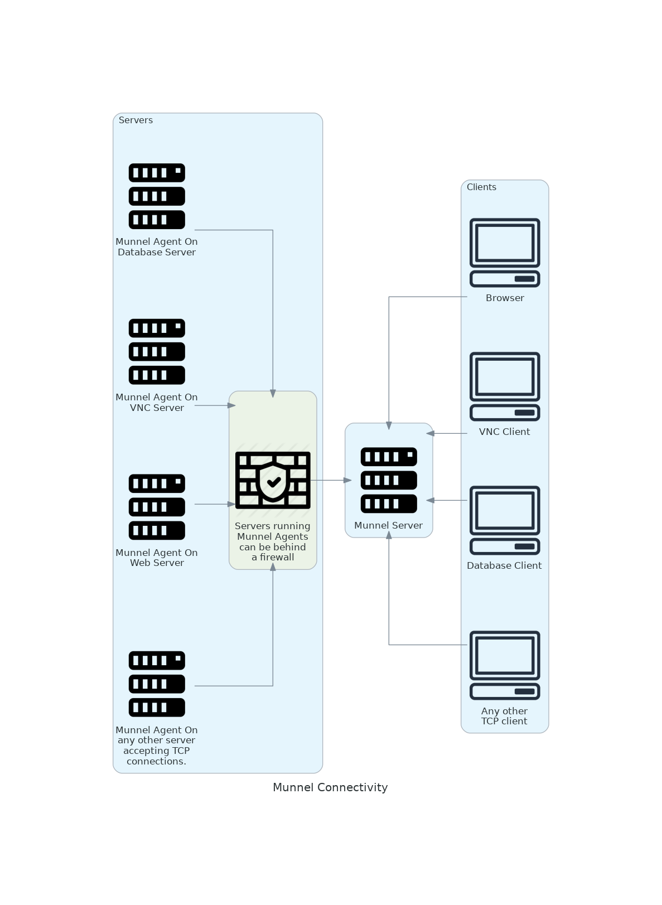

# Munnel
Munnel load-balances and proxies/relays TCP connections. Munnel has two parts: server and agent(s). When a connection is made to the server, the server tells an agent to connect, and the connections are relayed (concurrently bi-directionally streamed). With an agent running on a host that might be behind a firewall, proxied connections can be made to services on the host without the need to open firewall ports as long as outbound connections are allowed by the agent running on the host. One server can use many agents, and agents can be organized into groups that are round-robin load-balanced. Munnel runs on Windows and Linux. It has not yet been compiled for Mac.
# Download
Munnel for Linux: [munnel_linux.zip](assets/release/munnel_linux.zip)

Munnel for Windows: [munnel_windows.zip](assets/release/munnel_windows.zip)
# How It Works


## Connection process
1. The Munnel Agent makes and maintains a connection to the Munnel Server on the port specified in the configuration (this can be a non-standard port, or a common port like 80, 443, etc). If the Munnel Agent loses the connection for any reason (bad network connectivity, unplugged cable, etc), it will try to reconnect every 5 seconds.
2. The Munnel Server accepts Agent connections and listens on the service port for client connections. Munnel Agents can specify a group name to which they belong, which the Munnel Server will use to determine which Agents will service a client. If a Munnel Agent does not specify a group name, then it defaults to servicing all client connections. The Munnel Server will load-balance connections to multipel Agents in a group.
3. When a client connects on the service port, the Munnel Server sends a command to the Munnel Agent to initiate a connection to a specified address (e.g. localhost:80, localhost:5900, example.server.net:2000, etc). 
4. When the Munnel Agent receives a command from the server to initiate a connection, it connects to the specified address and connects to the Munnel Server. It then proxies the two connections.
5. Once the Munnel server receives the connection from the Agent, it proxies the connection to the client.

The Munnel Server is responsible for telling Munnel Agents where to connect, and those destination addresses are contained in the Munnel Server's configuration file. The Munnel Agents only specify the group to which they belong.

# How To Use It
The server configurations are a list of "services" that specify the following:
1. The service name
2. On which port the server will listen for incoming connections for a given service
3. The group name of the agents to use (group names are optional)
4. What destination address an agent will connect to for that service

## Server Mode
To run the server, you have to specify the interface and port to which it will bind and listen for agent connections. Additionally, you can specify services on the command line or in a configuration file. With no service configuration specified, the server will exit. You can specify any number of services on the command line or in the configuration file.
```shell
munnel server <INTERFACE_IP:PORT> "<SERVICE_NAME> <AGENT_GROUP_NAME> <SERVICE_INTERFACE_IP:PORT> <AGENT_DEST_ADDRESS:PORT>" "...(more service specifications)"
```
Example:
```shell
munnel server 0.0.0.0:10001 "WinVNC WinVNCGroup 0.0.0.0:5900 localhost:5900"
```

## Agent Mode
To run the agent, you need to specify the server's address and, optionally, a group name. The agent has no configuration file. 
If an agent does not specify a group name, then the server assumes that the agent can handle **all** service connections.
```shell
munnel agent <SERVER_INTERFACE_IP:PORT> [GROUP_NAME]
```
Example:
```shell
munnel agent 10.0.0.143:10001 WinVNCGroup
```
If the agent's connection to the server drops for any reason, the agent will try to reconnect every 5 seconds.
## Simple Scenario
You have a Windows workstation that you want to remotely control using the VNC server that is running on it. Inbound connections can't be allowed through the firewall on that Windows workstation. However, there's a Linux workstation that can be used to accept connections from both the Windows workstation and your VNC client. Assuming the Linux workstations's IP is 10.0.0.143, to proxy VNC connections through the Linux workstation, you can do the following:

On the Linux workstation, run the following:
```shell
munnel server 0.0.0.0:10001 "WinVNC WinVNCGroup 0.0.0.0:5900 localhost:5900"
```
On the Windows workstation, run the following:
```shell
munnel agent 10.0.0.143:10001 WinVNCGroup
```

On the Linux workstation, the command will start a Munnel server that:
1. Listens for agent connections on all interfaces on port 10001
2. Listens for VNC connections on all interfaces on port 5900
3. Specfies that, when a VNC client connects on port 5900, it will tell the agent to proxy a connection between the agent's localhost:5900 and the Munnel server.

On the Windows workstation, the command will start a Munnel agent that:
1. Connects to the Munnel server on the Linux workstation
2. Tells the Munnel server that it belongs to the "WinVNCGroup"
3. Waits for the server to tell it where to connect 

**After running these commands on the Linux and Windows workstations, you will be able to use your VNC client to connect to 10.0.0.143:5900, and the connection will be proxied to the Windows VNC server.**

## Less Trivial Scenarios
Because Munnel uses a high-performance event-loop paradigm that uses Rust futures  (thanks to [Tokio](https://github.com/tokio-rs/tokio)) coupled with asynchronous I/O (thanks to [Metal IO](https://github.com/tokio-rs/mio)), it can service many concurrent connections. Complex scenarios could include load-balancing to a cluster of services behind a firewall, proxying connections from a static IP to backend servers that use dynamic IPs, or relaying connections using "chains" of Munnel servers and agents to anonymize traffic.
# Build
Munnel was written using Rust v1.56.1 and compiled using Cargo v1.56.0.
# Motivation
Munnel is my first Rust application, and throughout my career, I've occaisionally needed its capabilities. Other options weren't viable for me, so I decided to get familiar with Rust by building this application.
# To Do
- Implement a Web UI to manage Munnel
- Support hot-reload of configurations
- Develop a system service to run Munnel on both Linux and Windows systems
- Test the use of kernel threads for established connections, or a configurable static number of kernel threads that each runs an event loop
- Implement timeouts for pending connections that do not receive a response from an agent (cover all possible rare scenarios involving connectivity failure)
- If performance requirements increase, research the use of zero-copy to bypass the kernel for network I/O.
